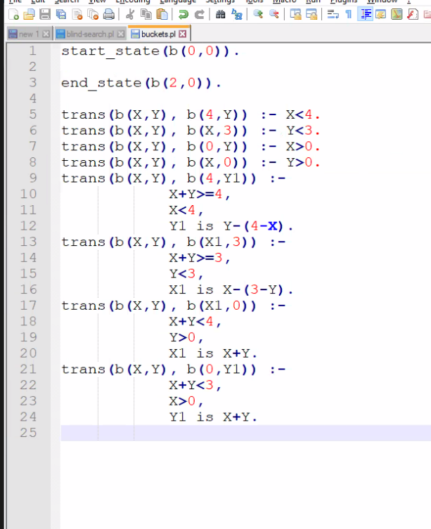
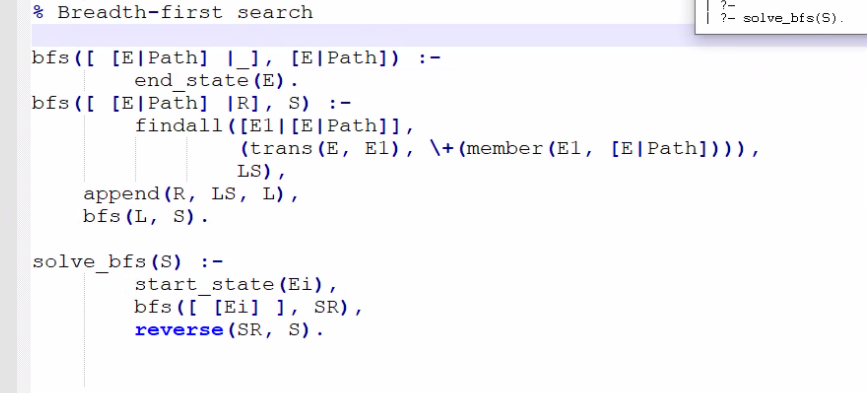

# Two bucket problem

We have 2 buckets, 4L and 3L, and want to end up with 2L on the first one.

## States

Two integers representing the amount of water (L) in each bucket.

- **Initial state** - 0L in each bucket.
- **End state** - Any state with 2L in the first bucket.

We'll refer to states like this from now on: [CapA, CapB].

Note: some states are not reachable, e.g.: [2, 1] and [2, 2].

## Operators

Fill bucket, empty bucket, pour bucket into the other bucket.

**Note**: some operators can be reversible: fill bucket <-> empty bucket

## Prolog

## Other notes

Depth first search can generate an infinite depth tree and doesn't always find
the optimal solution (reaches states in a possibly longer way).
